# What is the difference between:

**CMD vs ENTRYPOINT**

- CMD: provides default arguments for the container's command. These defaults are easy to override by passing arguments to `docker run`.
- ENTRYPOINT: defines the container's main executable. Arguments provided by `CMD` or `docker run` are passed to the `ENTRYPOINT`. Overriding `ENTRYPOINT` is possible but requires `--entrypoint` at runtime (so it's less likely to be accidentally changed).

- When only `CMD` is set, `docker run image <args>` replaces the `CMD` entirely.
- When `ENTRYPOINT` is set (exec form), `CMD` provides default arguments that are appended to the `ENTRYPOINT` command.
`docker run image` prints `hello`. `docker run image world` runs `echo world`.

**COPY vs ADD**

- COPY: copies files and directories from the build context into the image. Prefer `COPY` for predictable, explicit behavior.
- ADD: does everything `COPY` does, and also:
	- Automatically extracts local `tar`, `tar.gz`, `tgz`, `bzip2`, `xz` archives into the image.
	- Can download remote URLs (e.g., `ADD https://example.com/file /dest`) — this makes builds less reproducible and is generally discouraged.

# Problem 1

- **Run the container hello-world**:
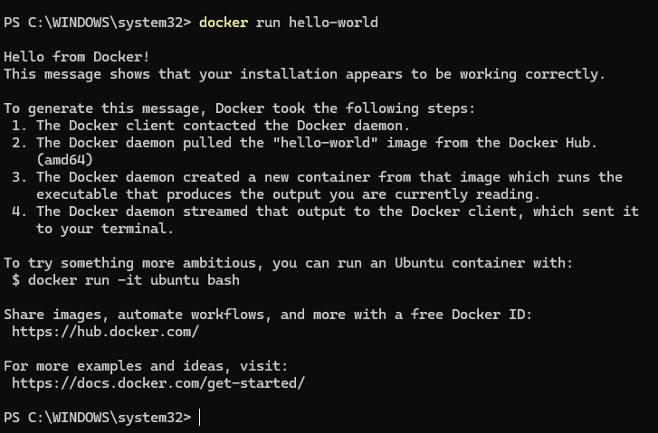

- **Check the container status**:
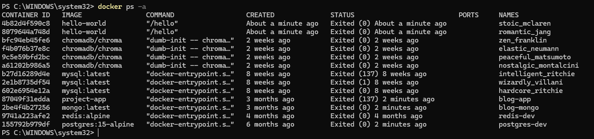

- **Start the stopped container**:
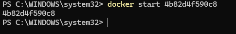

- **Remove the container**:
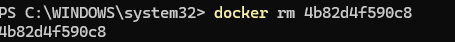

- **Remove the image**:
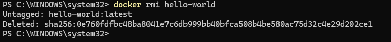

# Problem 2

- **Run container centos or ubuntu in an interactive mode**:
- **Run the following command in the container “echo docker**:
- **Open a bash shell in the container and touch a file named hello-docker**:
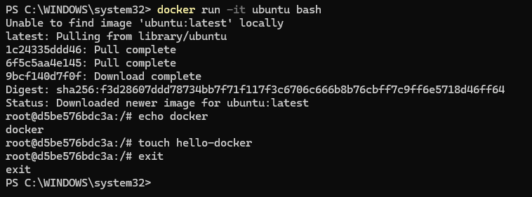

- **Stop the container and remove it. Write your comment about the file hello-docker**:
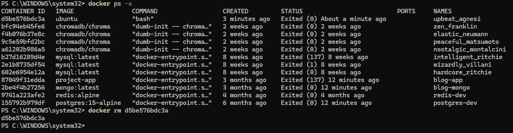
Comment about hello-docker file:
The file is lost when container is removed because containers are ephemeral.
To persist data, you'd need volumes or commit the container.

- **Remove all stopped containers**:
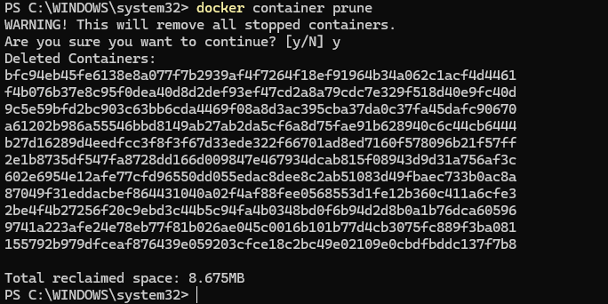

# Problem 3

- **Deploy a MySQL database called app-database. Use the mysql latest image, and use the
-e flag to set MYSQL_ROOT_PASSWORD to P4sSw0rd0!. The container should run in the
background.**:
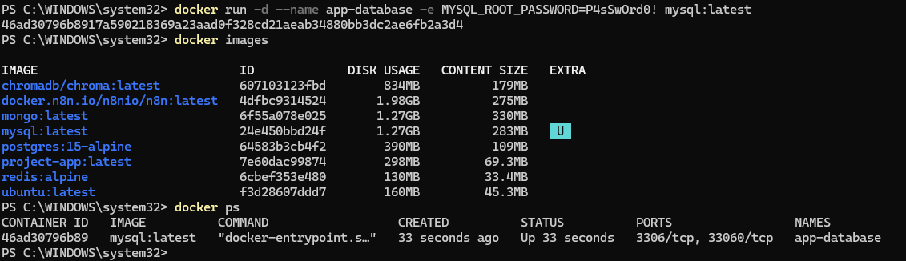

# Problem 4

- **Run the image Nginx**:
- **Add html static files to the container and make sure they are accessible**:
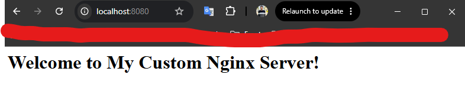

- **Create a python simple app**:
- **Create a dockerfile to containerize the python app**:
- **Build the image and test it**:
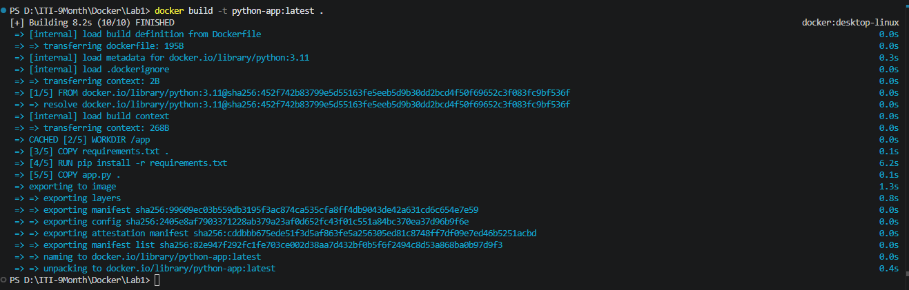
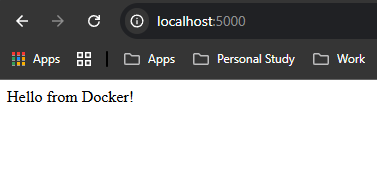

- **Push the created image into your docker hub repo**:
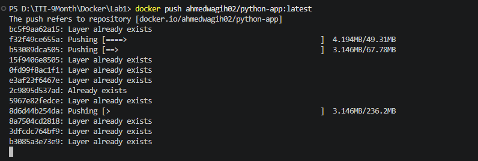
